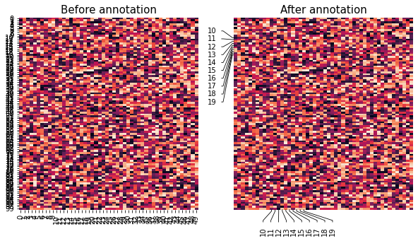
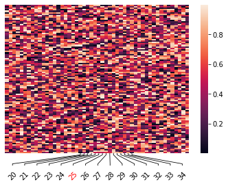

# plotannot
[](https://pypi.org/project/plotannot/)

# Introduction
_plotannot_ is a a python package to automatically highlight and adjust overlapping ticklabels in matplotlib/seaborn plots.

This package started as the need of ComplexHeatmap (R package) style annotations for Python plots but is also created with great inspiration and appreciation of the _statannot_ package ([webermarcolivier/statannot](https://github.com/webermarcolivier/statannot) - now maintained at [trevismd/statannotations](https://github.com/trevismd/statannotations)), as well as the _adjustText_ package ([Phlya/adjustText](https://github.com/Phlya/adjustText)).



## Features

- Add annotation lines for certain row/column labels
- Shift labels to not overlap
- Add additional highlights such as color, fontsize, etc. to certain row/column labels


## Getting started

Install from PyPI:

```pip install plotannot```

Or directly from github:

``` pip install git+git://github.com/msbentsen/plotannot ```

Requirements for package:
- Python >= 3.6
- matplotlib
- numpy


## Simple example

```
#Plot heatmap
ax = sns.heatmap(table, xticklabels=True, yticklabels=False)

#Rotate all labels
plotannot.format_ticklabels(ax, axis="xaxis", rotation=45)

#Annotate labels
to_label = range(20,35)
plotannot.annotate_ticks(ax, axis="xaxis", labels=to_label) 

#Color individual labels
plotannot.format_ticklabels(ax, axis="xaxis", labels=[25], color="red")
```


Additional examples are found in the [examples notebook](examples/examples.ipynb). 

## Documentation and help

Documentation of the main functions are found at: 


Issues and PRs are very welcome - please use the [repository issues](https://github.com/msbentsen/plotannot/issues) to raise an issue/contribute.


